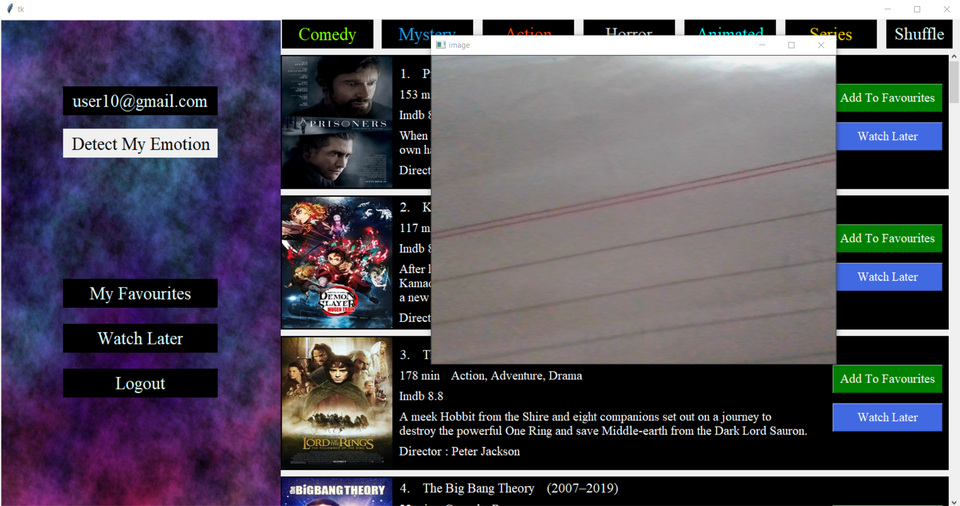

# Movie Recommendation System using tkinter and MySql

Features:
* Login/Signup Functionality
* Showing Movies according to categories
* Recommending movies based on live emotion tracking using FER
* Add To Favourites and Remove From Favourites
* Add To Watch Later and Remove From Watch Later
* Random Shuffle Of Movies and Series

Implementation:
* Parsing Movie Data through imdb sites and storing info in mysql database(Code availavle at movie_data_parse.py)
* Downloading and compressing images using url provided by imdb and storing them inside project(In imgs folder for this project)
* Implementing a scrollable frame inside tkinter window

Few Images:

# How To Setup

* 1.Create a MySQL schema and import the database provided in folder.
* 2.This already contains user as well as movies information.
* 3.In your python editor change ostpl_mp to your MySQL database name in main.py and scroll_example.py
* 4.pip install all required dependencies.
* 5.Emotion through USer uses FER and other libraries so install them to avoid errors.

# Without Emotion Through User
* Remove getEmotion function from scroll_example.py and delete emotionthroughuser.py